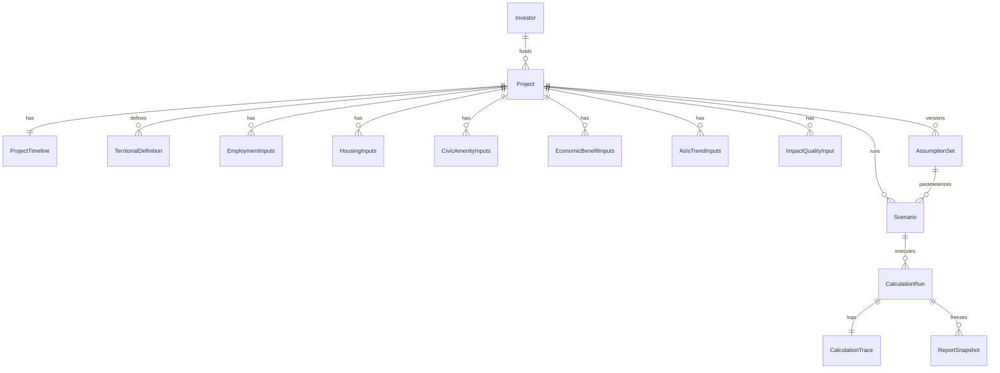

# Doménový model MHDSI (implementace)

**Zdroj pravdy:** `docs/mhdsi-system-spec.md` (odvozené z PDF MHDSI 1.7).  
**Technologie:** TypeScript + Zod, interní názvy v angličtině, uživatelská vrstva zatím mimo rozsah.

---

## Adresářová struktura

```
src/domain/
  index.ts                    # re-exporty
  modules.ts                  # M0–M8, VYP_* + Zod enum
  field-meta.ts               # typ FieldMeta (dokumentace / codegen)
  assumptions-registry.ts     # AssumptionKeys + DefaultAssumptionValues
  open-questions.ts           # OQ-01–11 identifikátory (ne defaulty)
  assumption-set.ts
  scenario.ts
  common/
    geometry.ts               # AOIVuz, WGS84 bod
  raw/
    investor.ts
    project.ts
    project-timeline.ts
    territorial-definition.ts
    inputs-employment.ts
    inputs-housing.ts
    inputs-civic.ts
    inputs-economic.ts
    inputs-as-is-trends.ts    # M2 — v2 napojení na feedy
    inputs-impact-quality.ts  # katalog kvalita 1–5 (bez INP-* ve spec tabulce)
  derived/
    derived-values.ts         # DRV-001–032 (blok)
  outputs/
    calculation-outputs.ts  # VYP výstupy + summary
  audit/
    calculation-run.ts
    calculation-trace.ts
  report/
    report-snapshot.ts
```

**Vrstvy modelu**

| Vrstva | Umístění | Účel |
|--------|----------|------|
| Raw inputs | `raw/*`, `scenario.ts`, části `territorial-definition` | INP-* podle tabulek ve spec |
| Derived values | `derived/derived-values.ts` | DRV-* meziproměnné |
| Calculated outputs | `outputs/calculation-outputs.ts` | VYP bloky + agregace |
| Assumptions | `assumption-set.ts`, `assumptions-registry.ts` | CONFIGURABLE + verze + odkazy |
| Audit trace | `audit/calculation-trace.ts` (`runId` = `CalculationRun.id`) | kroky, OQ odkazy |

---

## Přehled entit a vazeb



---

## Entity → modul (M*), zdroj (INP/DRV)

| Entita | Primární moduly | Poznámka |
|--------|-----------------|----------|
| `Investor` | M0 | INP-011 |
| `Project` | M0 | INP-001–012 |
| `ProjectTimeline` | M0 | INP-007, INP-008 |
| `TerritorialDefinition` | M1 | INP-101–108 |
| `EmploymentInputs` | M3 | INP-301–316 |
| `HousingInputs` | M4 | INP-401–412 |
| `CivicAmenityInputs` | M5 | INP-501–511 |
| `EconomicBenefitInputs` | M6 | INP-601–616 |
| `AsIsTrendInputs` | M2 | INP-201–205 (v2 plné napojení) |
| `ImpactQualityInput` | M6 / M8 | katalog kvalita 1–5 (bez INP-* v tabulce vstupů) |
| `Scenario` | M7 | min. 3 scénáře, `scenario_id` |
| `AssumptionSet` | všechny M* | CONFIGURABLE klíče + `methodologyConfigVersion` |
| `CalculationRun` | M3–M6 podle rozsahu | vstupní snapshot + derived + outputs |
| `CalculationTrace` | audit | VYP / DRV / vstupy kroků |
| `ReportSnapshot` | M8 | osnova oddílu 3.1 ve spec |

---

## Pole: typ, MVP, zdroj, modul (shrnutí)

Konvence: ve zdrojovém kódu je u většiny polí komentář `INP-xxx` / odkaz na DRV.  
Detailní klasifikace (EXPLICIT / CONFIGURABLE / OPEN_QUESTION) je ve `mhdsi-system-spec.md`.

### MVP — povinná pole (pro „plný“ vstup dle spec MVP tabulky)

**M0 — Project + Investor + Timeline**

| Pole (kód) | Typ | Povinnost MVP | Zdroj | Modul |
|------------|-----|---------------|-------|-------|
| `projectName` | string | ano | INP-001 | M0 |
| `locationDescription` | string | ano | INP-002 | M0 |
| `scopeCapacity` | record | ano | INP-004 | M0 |
| `czNace` | string | ano | INP-005 | M0 |
| `capexTotalCzk` | number | ano | INP-006 | M0 |
| `nInv` | int | ano | INP-009 | M0 |
| `employmentStructure[]` | table | ano | INP-010 | M0 |
| `investorProfile` | string | ano | INP-011 | M0 |
| `legalForm` | string | ano | INP-011 | M0 |
| `t0` | string | ano | INP-008 | M0 |
| `schedulePhases[]` | phases | ano | INP-007 | M0 |

**M1 — TerritorialDefinition (MVP: ruční varianta)**

| Pole | Typ | MVP | Zdroj | Modul |
|------|-----|-----|-------|-------|
| `dLastMileKm` nebo `municipalityCodes` / `aoisPolygonsManual` | number / array / unknown | ano (jedna z cest) | INP-102 / tabulka MVP ve spec | M1 |
| `diadPrMinutes`, `diadAkMinutes`, `tinfrMinutes` | number | ano (v scénáři nebo území) | INP-103–105 | M1 |

**Scénáře**

| Pole | Typ | MVP | Zdroj | Modul |
|------|-----|-----|-------|-------|
| `scenarioId`, `kind` | string, enum | ano | explicitní pravidlo | M7 |
| `assumptionSetId` | uuid | ano | — | M7 |

**AssumptionSet**

| Pole | Typ | MVP | Zdroj | Modul |
|------|-----|-----|-------|-------|
| `methodologyConfigVersion` | string | ano | verze sady | vše |
| `overrides` | record | ano (může být prázdné + defaulty z registry) | CONFIGURABLE | vše |

**Výpočet**

| Pole | Typ | MVP | Zdroj | Modul |
|------|-----|-----|-------|-------|
| `inputSnapshotRef` | string | ano | audit | M3–M6 |
| `derived` (vyplněné) | object | po doběhu | DRV-* | M1–M6 |
| `outputs.vypBlocks` | array | po doběhu | VYP | M3–M6 |

**Report**

| Pole | Typ | MVP | Zdroj | Modul |
|------|-----|-----|-------|-------|
| `outlineSections` (1–10) | array | ano | oddíl 3.1 ve spec | M8 |

---

### v2 — pole / funkce spíše později

| Oblast | Příklady | Důvod (spec) |
|--------|----------|----------------|
| M1 | `isochroneEngine` ORS/ESRI, plný JSON overlay částí obcí | MVP bez povinného ORS |
| M2 | `AsIsTrendInputs` z feedů ČSÚ/Eurostat | MVP tabulka v2 |
| M3–M5 | plné registry MŠMT, ÚZIS, scraping realit, 80 % korekce | v2 |
| M6 | plný `VYP_2.4_1` s ročními profily, (X−M), IO/TiVA, NPV | MVP částečný HDP |
| M8 | `exportFormats` obsahuje PPTX, mapové přílohy | MVP JSON/CSV |
| `Project.aoivuzGeom` | striktní GeoJSON validace | nyní passthrough + rozšíření |

---

## Metodické nejasnosti ovlivňující model (OQ)

Převzato ze spec — model je rozšiřitelný (`extension`, `openQuestionRefs` v trace):

| ID | Dopad na model |
|----|----------------|
| OQ-01 | `DIADak_kor` vs znaménko `Tinfr` — `AssumptionKeys.DIADAK_TINFR_SIGN` nebo ekvivalent v overrides |
| OQ-02 | `T_posm` jednotky — `tPosmMinutes` v derived musí nést poznámku ve trace |
| OQ-03 | trend `V0_Vk_n` — `v0VkNTrend` v `AsIsTrendInputs` jako obecný záznam |
| OQ-04 | agregace substituce napříč profesemi — `extension` na employment / trace |
| OQ-05 | nepřímá/indukovaná PMJ — není uzavřený vzorec; pouze kontext HDP v M6 |
| OQ-06 | Situce A vs B — `housingInputs.situationAb` uživatelská volba |
| OQ-07 | sekce 0.6 seznam výpočtů — metadata reportu / přílohy |
| OQ-08 | NX zdravotnictví — tabulka v `civicAmenityInputs.extension` |
| OQ-09 | text mitigace vs zaměstnanost — čistě reportová konzistence |
| OQ-10 | θ a RUD v čase — `sourceRefs` u assumption set + legislativní verze |

---

## Assumptions registry

Soubor `src/domain/assumptions-registry.ts` definuje `AssumptionKeys` a výchozí čísla z příkladů v PDF (CONFIGURABLE — vždy ověřit vůči platné legislativě a roku).

---

## Verze

Dokument navázán na `mhdsi-system-spec.md` verze 1.1 (2026-04-02).
